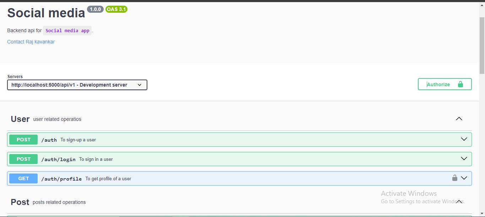

# Social media backend



### Environment file setup

create `.env` file

```sh
PORT=
NODE_ENV=
POSTGRES_PASSWORD=
DATABASE_URL=
JWT_SECRET=
JWT_EXPIRY=
CLOUDINARY_BUCKET=
CLOUDINARY_KEY=
CLOUDINARY_SECRET=
```

### Setup with docker

change port maping according to `PORT` in `docker-compose.yaml`

Run comand in folder  
For adminer in dev env _(Web interface for displaying data from database)_

```sh
docker-compose -f docker-compose.dev.yaml up -d
```

Without adminer

```sh
docker-compose up -d
```

### Setup without docker

- install NPM packages

```sh
npm install
```

- Generate prisma client

```sh
npx prisma generate
```

- Run development server _(With nodemon)_

```sh
npm run dev
```

---

- Build production

```sh
npm run build
```

- Run production build

```sh
npm run start
```
